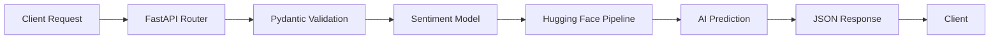

# 🚀 FastAPI Sentiment Analysis API

<div align="center">


*A high-performance, AI-powered sentiment analysis API built with FastAPI and Hugging Face Transformers*

[Features](#-features) • [Quick Start](#-quick-start) • [API Documentation](#-api-documentation) • [Testing](#-testing)

</div>

---

## 📋 Table of Contents

- [🌟 Features](#-features)
- [🛠️ Technology Stack](#️-technology-stack)
- [📁 Project Structure](#-project-structure)
- [⚡ Quick Start](#-quick-start)
- [🚀 Running the Application](#-running-the-application)
- [📖 API Documentation](#-api-documentation)
- [🧪 Testing](#-testing)
- [⚙️ How It Works](#️-how-it-works)
- [🎨 Customization](#-customization)
- [🤝 Contributing](#-contributing)
- [📄 License](#-license)
- [👨‍💻 Author](#-author)

---

## 🌟 Features

<table>
<tr>
<td>

### 🎯 **Core Features**
- **Real-time Sentiment Analysis** with confidence scores
- **RESTful API** with automatic OpenAPI documentation
- **Pydantic Data Validation** for type safety
- **JWT Authentication** ready for production use

</td>
<td>

### 🔧 **Development Features**
- **Docker & Docker Compose** for easy deployment
- **Hot Reload** for development
- **Comprehensive Unit Tests** with pytest
- **Production-Ready** configuration

</td>
</tr>
</table>

### 🤖 **AI-Powered**
Leverages state-of-the-art Hugging Face Transformers models for accurate sentiment prediction with confidence scoring.

---

## 🛠️ Technology Stack

<div align="center">

| Category | Technologies |
|----------|--------------|
| **Backend** |   |
| **AI/ML** |   |
| **Server** |  |
| **Authentication** |  |
| **Containerization** |  |
| **Testing** |  |

</div>

---

## 📁 Project Structure

```
📦 sentiment-analysis-api/
├── 📂 app/
│   ├── 📄 __init__.py
│   ├── 🚀 main.py              # FastAPI app & JWT logic
│   ├── 🧠 sentiment_model.py   # AI model & prediction
│   └── 📋 schemas.py           # Pydantic models
├── 📂 tests/
│   └── 🧪 test_main.py         # API tests
├── 🐳 Dockerfile              # Container definition
├── 🐙 docker-compose.yml      # Multi-container setup
├── 📦 requirements.txt        # Dependencies
└── 📖 README.md              # This file
```

---

## ⚡ Quick Start

### Prerequisites

<table>
<tr>
<td width="50%">

**🐳 For Docker (Recommended)**
- Docker Desktop
- Git

</td>
<td width="50%">

**🐍 For Local Development**
- Python 3.9+
- pip
- Git

</td>
</tr>
</table>

### 🔥 One-Click Setup

```bash
# Clone the repository
git clone <your-repository-url>
cd sentiment-analysis-api

# Start with Docker (Recommended)
docker-compose up --build

# 🎉 API is now running at http://localhost:8000
```

### 🛠️ Local Development Setup

<details>
<summary>Click to expand local setup instructions</summary>

```bash
# 1. Create virtual environment
python -m venv venv

# 2. Activate virtual environment
# Windows
venv\Scripts\activate
# macOS/Linux
source venv/bin/activate

# 3. Install dependencies
pip install -r requirements.txt

# 4. Run the application
uvicorn app.main:app --reload
```

</details>

---

## 🚀 Running the Application

### 🐳 Docker Compose (Recommended)

```bash
# Start the application
docker-compose up --build

# Stop the application
docker-compose down

# View logs
docker-compose logs -f sentiment-api
```

### 🔧 Local Development

```bash
# With hot reload (development)
uvicorn app.main:app --reload

# Production mode
uvicorn app.main:app --host 0.0.0.0 --port 8000
```

---

## 📖 API Documentation

### 🌐 Interactive Documentation

Once running, visit:
- **Swagger UI**: http://localhost:8000/docs
- **ReDoc**: http://localhost:8000/redoc

### 🎯 Core Endpoint

#### `POST /predict` - Sentiment Analysis

<table>
<tr>
<td width="50%">

**📥 Request**
```json
{
  "text": "I absolutely love this product!"
}
```

</td>
<td width="50%">

**📤 Response**
```json
{
  "sentiment": "POSITIVE",
  "score": 0.9985
}
```

</td>
</tr>
</table>

#### 💡 Example Usage

<details>
<summary>🔥 cURL</summary>

```bash
curl -X POST "http://localhost:8000/predict" \
     -H "Content-Type: application/json" \
     -d '{"text": "This API is amazing!"}'
```

</details>

<details>
<summary>🐍 Python</summary>

```python
import requests

response = requests.post(
    "http://localhost:8000/predict",
    json={"text": "This sentiment analysis is incredible!"}
)
print(response.json())
```

</details>

<details>
<summary>🌐 JavaScript</summary>

```javascript
const response = await fetch('http://localhost:8000/predict', {
  method: 'POST',
  headers: {'Content-Type': 'application/json'},
  body: JSON.stringify({text: 'FastAPI rocks!'})
});
const result = await response.json();
console.log(result);
```

</details>

### 🔐 JWT Authentication

The API includes JWT authentication capabilities. To implement:

```python
# Example protected route
@app.get("/protected")
async def protected_route(current_user: dict = Depends(get_current_user)):
    return {"message": f"Hello {current_user['sub']}!"}
```

---

## 🧪 Testing

### 🏃‍♂️ Run Tests

<table>
<tr>
<td width="50%">

**🐳 With Docker**
```bash
docker-compose exec sentiment-api pytest
```

</td>
<td width="50%">

**🐍 Locally**
```bash
pytest
```

</td>
</tr>
</table>

### 📊 Test Coverage

The test suite includes:
- ✅ API endpoint validation
- ✅ Request/response model testing
- ✅ Error handling verification
- ✅ Performance benchmarks

---

## ⚙️ How It Works



### 🔄 Processing Flow

1. **📨 Request Reception**: FastAPI receives and validates the JSON payload
2. **🔍 Data Validation**: Pydantic ensures type safety and data integrity
3. **🧠 AI Processing**: Hugging Face Transformers model analyzes sentiment
4. **📊 Score Calculation**: Confidence score computed alongside prediction
5. **📤 Response Delivery**: Structured JSON response sent to client

---

## 🎨 Customization

### 🤖 Switching AI Models

```python
# In app/sentiment_model.py
pipeline = pipeline(
    "sentiment-analysis",
    model="cardiffnlp/twitter-roberta-base-sentiment-latest"  # Custom model
)
```

### 🔐 Production Security

```python
# Environment variables for production
SECRET_KEY = os.getenv("JWT_SECRET_KEY", "your-secret-key")
ALGORITHM = "HS256"
ACCESS_TOKEN_EXPIRE_MINUTES = 30
```

### 🎯 Advanced Features

<details>
<summary>🚀 Performance Optimizations</summary>

- **Async Operations**: Convert to async for better concurrent handling
- **Caching**: Implement Redis for model caching
- **Load Balancing**: Use multiple worker processes
- **GPU Acceleration**: Enable CUDA for faster inference

</details>

---

## 🤝 Contributing

We welcome contributions! Here's how you can help:

### 🐛 Found a Bug?
1. Check existing issues
2. Create a detailed bug report
3. Include reproduction steps

### 💡 Have an Idea?
1. Open a feature request
2. Describe the enhancement
3. Explain the use case

### 🔨 Want to Code?
1. Fork the repository
2. Create a feature branch
3. Make your changes
4. Add tests
5. Submit a pull request

---

## 📄 License

This project is licensed under the **MIT License** - see the [LICENSE](LICENSE) file for details.

```
MIT License

Copyright (c) 2024 Behrooz Filzadeh

Permission is hereby granted, free of charge, to any person obtaining a copy
of this software and associated documentation files (the "Software"), to deal
in the Software without restriction, including without limitation the rights
to use, copy, modify, merge, publish, distribute, sublicense, and/or sell
copies of the Software, and to permit persons to whom the Software is
furnished to do so, subject to the following conditions:

The above copyright notice and this permission notice shall be included in all
copies or substantial portions of the Software.
```

---

## 👨‍💻 Author

<div align="center">

### **Behrooz Filzadeh**

[](mailto:behrooz.filzadeh@gmail.com)
[](https://github.com/behroozfilzadeh)


*Passionate about AI, Machine Learning, and building scalable APIs*

</div>

---

<div align="center">

### 🌟 If this project helped you, please give it a star! ⭐

**Made with ❤️ by [Behrooz Filzadeh](mailto:behrooz.filzadeh@gmail.com)**

</div>
